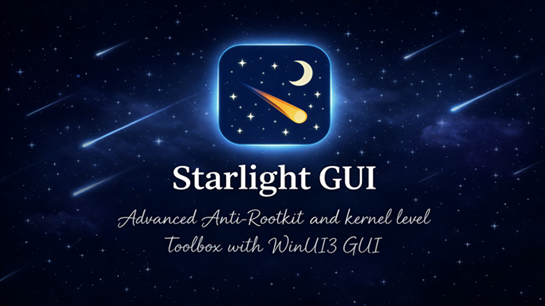

<h1 align="center">
  <p align="center">
    
  </p>
    Starlight GUI
  <p align="center">
    <a href="https://www.gnu.org/licenses/gpl-3.0.html">
      
    </a>
    <a href="https://opensource.org/license/gpl-3-0">
      
    </a>
    <a href="https://github.com/microsoft/cppwinrt">
      
    </a>
    <a href="https://space.bilibili.com/670866766">
      
    </a>
    <a href="https://ifdian.com/a/StarsAzusa">
      
    </a>
  </p>
</h1>

**[中文](README.md) | English**

Starlight GUI is an open-source WinUI3 project built with C++/WinRT — a passion project by its developer, aiming to create a powerful, visually appealing, and easy-to-use open-source kernel-level toolbox for Windows 10 / 11. The project uses native WinUI3 design, seamlessly matching the look and feel of Windows 11. It offers a wide range of practical features and customization options to enhance your PC experience.

**Developer**: Stars
**License**: GPL 3.0 License | OSI Certified
**Copyright © 2026 Starlight. All Rights Reserved.**
**Downloads**:
- Quark Drive: `https://pan.quark.cn/s/ee7a29ca2a76` (Code: `vVmj`)
- GitHub Releases/Actions: `https://github.com/OpenStarlight/StarlightGUI`
- QQ Group: `1041508876`


## Important: Distribution Channel Adjustment

Starting from Starlight GUI **v4.0.0**, the software distribution will be adjusted to a dual-channel model.
**Standard/Free Edition**: Can be downloaded directly from **Quark Drive / QQ Group / GitHub Releases / GitHub Actions**.
**Premium Edition**: Build the **complete source code** yourself, or sponsor the author on [Ifdian](https://ifdian.net/a/StarsAzusa) and download it from the QQ Group.

### What does this mean?

This change does not mean the software is becoming paid software. The source code remains **open source**, and our original intention remains unchanged. You can pull and build the complete source code yourself to use the Premium Edition for free.
The Standard Edition and Premium Edition are **almost identical** in functionality, with only a few extremely technically demanding features restricted.
The purpose of the Premium Edition is to provide a way to **support the developer**, similar to many other open-source projects. We will not add verification mechanisms to the Premium Edition, and we do not mind you sharing the Premium Edition with friends, as long as you do not violate the license agreement (large-scale redistribution, resale, etc.).
Thank you very much for your understanding. Development is not easy — your support is greatly appreciated!

## Key Features

### Task Manager
- Fully redesigned task manager
- Integrates most core system task manager features
- Driver-level process control (terminate, adjust, permissions, etc.)
- Launch processes with elevated privileges
- Read/write process memory, inject DLLs

### Module Manager
- View all system-loaded modules
- Easily load and unload drivers
- Load unsigned drivers
- Driver hiding capabilities

### File Manager
- Modern UI file manager
- Multiple user-level and kernel-level file enumeration methods
- Force-delete files

### Window Manager
- View all system windows (including hidden ones)
- Force show/hide window operations

### System Monitor
- ARK-level kernel resource viewer
- Comprehensive data at a glance

### Memory Disassembly
- Read arbitrary memory
- Convert read memory to hexadecimal values or assembly code
- Write arbitrary content to arbitrary memory

### Settings
- Feature module configuration
- UI personalization options

## Development Setup

### Requirements
- `Windows 10 / 11` operating system
- `Visual Studio 2026` (recommended)
- `C++ 20` or later
- `C++/WinRT WinUI3` development workload

### Installation Steps

1. **Clone the repository**
   ```bash
   git clone https://github.com/OpenStarlight/StarlightGUI.git
   cd StarlightGUI
   ```

2. **Open the project in Visual Studio**
   - Open `Visual Studio`
   - Select `Open a project or solution`
   - Navigate to the project directory and select the `.sln` solution file

3. **Restore NuGet packages**
   - Right-click the solution in Solution Explorer
   - Select `Restore NuGet Packages`

4. **Configure the build environment**
   - Make sure the correct build configuration is selected (Debug/Release)
   - This project depends on `WinUI3` — ensure the architecture is configured correctly

5. **Build and run**
   - Use the menu: `Build` → `Build Solution`

6. **Create a distributable package**
   - Extract all files from the `x64/Release(Debug)` folder in the project directory — `StarlightGUI.exe` is the executable
   - You may create an archive or installer from these files

(OPTIONAL) **Notes**
1. If you encounter breakpoints caused by `Invalid parameter` errors when launching the project, simply ignore them — they do not affect program execution.
2. If the app crashes when switching to certain pages, try disabling `XAML Hot Reload` in Visual Studio.

## Disclaimer

**Important**: This project is intended for educational and research purposes only. Users assume **full responsibility** for any consequences arising from the use of this software.

- This software is virus-free. Due to its elevated-privilege operations, antivirus false positives are **normal**
- This software involves low-level system operations; improper use may cause **system instability**
- Content loaded or created through this software may pose **potential security risks**
- Features of this software may cause **unexpected corruption or loss** of system or file data
> Please avoid using features that may cause a blue screen. If the driver is unexpectedly terminated during operation, it may cause permanent system damage and prevent the software from starting. Please be responsible for your own actions.

> All features are guaranteed to work perfectly when system requirements are fully met. Please ensure your system meets the requirements. Do not report issues caused by unmet requirements to the developer.

By installing and running this software, you acknowledge that you have **read and agreed** to the following:

- You are using this software with **full awareness of the associated risks**
- The developer is **not liable** for any losses caused by your use of this software
- You comply with local laws and regulations, use this software legally, and do not use it for **malicious purposes**
- You understand this software is a hobby project; the developer retains **final interpretation rights**
- You agree not to make any **insulting or defamatory remarks** about this software or its developer
> We understand we may not have done our best and welcome criticism and corrections from everyone. Please maintain a degree of respect for the developer.

**Special Driver Notice/Disclaimer**:

- All drivers used by this software are **self-developed**
- If you encounter antivirus warnings for drivers during use, please **temporarily** add them to your **trust list**, and make sure to **completely remove the trust** after you stop using the software
- Driver digital signatures are obtained from **unofficial channels** — do not trust the certificate
- **Unauthorized** use of this project's drivers for other purposes is **prohibited**
> Since the drivers are signed, they may be misleading and could potentially be exploited for illegal purposes. Please ensure you have not found these drivers running on your computer outside of this project. If you do, perform a security check immediately!

> Most of the technologies used in this project are publicly available and are used entirely legally within this project. If this project's drivers are used by programs outside of this project, the corresponding developers shall bear full responsibility for their actions! The developer of this project assumes no liability!

> Technology is innocent — the guilt lies with those who use it for illegal purposes. This project is open-source to promote technological advancement. We hope you will abide by this statement.

## Special Thanks

### AI-Assisted Development
- **Deepseek**
- **ChatGPT**
- **Copilot**
- **Claude**

### Project Support
- **Stars** — Main development
- **PspExitThread** — Driver development guidance
- **Wormwaker** — Ideas & Promotion
- **MuLin** — Testing
- **NtKrnl64** — Localization

### Development Environment
- **Visual Studio** — Powerful integrated development environment
- **Microsoft WinUI3** — Modern UI framework
- **C++/WinRT** — Efficient Windows Runtime support

## Localization
Project has supported multi-language localization, we welcome every developer and user from the world to use and maintain the project together!
You can submit a request at **Issues Page** for adding a new language, and upload your language file on official [Crowdin](https://crowdin.com/project/StarlightGUI)
This is the current localization of the project on Crowdin:
[](https://crowdin.com/project/StarlightGUI)

## Star History

<a href="https://www.star-history.com/?repos=OpenStarlight%2FStarlightGUI&type=date&legend=top-left">
 <picture>
   <source media="(prefers-color-scheme: dark)" srcset="https://api.star-history.com/image?repos=OpenStarlight/StarlightGUI&type=date&theme=dark&legend=top-left" />
   <source media="(prefers-color-scheme: light)" srcset="https://api.star-history.com/image?repos=OpenStarlight/StarlightGUI&type=date&legend=top-left" />
   
 </picture>
</a>

**Give us a star — it means a lot to us!**
